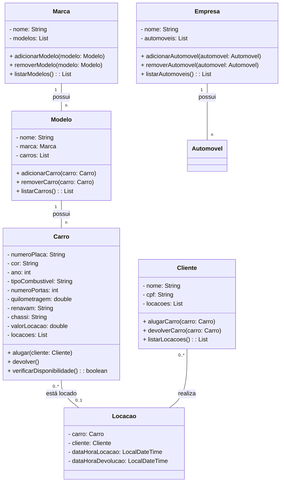

# Relatório: Sistema de Locação de Veículos

## 1. Introdução

O presente relatório tem como objetivo apresentar o diagrama de classes desenvolvido para um sistema de locação de veículos. O sistema visa gerenciar a locação de automóveis por parte de clientes, mantendo o controle sobre os veículos disponíveis, as locações realizadas e os clientes envolvidos.

## 2. Métodos

O diagrama de classes foi elaborado com base nos requisitos fornecidos, utilizando a linguagem de modelagem UML (Unified Modeling Language). Os principais métodos e atributos das classes incluídas no diagrama são os seguintes:

- **Empresa**: Representa a empresa de locação de veículos. Possui métodos para adicionar e remover automóveis, bem como para listar os automóveis disponíveis.

- **Marca**: Representa as marcas dos veículos. Possui métodos para adicionar e remover modelos, bem como para listar os modelos associados à marca.

- **Modelo**: Representa os modelos de veículos. Possui métodos para adicionar e remover carros, bem como para listar os carros associados ao modelo.

- **Carro**: Representa os automóveis disponíveis para locação. Possui métodos para alugar e devolver carros, além de verificar a disponibilidade de cada veículo.

- **Cliente**: Representa os clientes que realizam locações de veículos. Possui métodos para alugar e devolver carros, bem como para listar as locações realizadas pelo cliente.

- **Locação**: Representa as locações de veículos realizadas pelos clientes. Mantém informações sobre o carro locado, o cliente envolvido e as datas/horas de locação e devolução.

## 3. Resultados

O diagrama de classes desenvolvido oferece uma representação clara e concisa das entidades e relacionamentos envolvidos no sistema de locação de veículos. Ele permite uma compreensão detalhada da estrutura do sistema e dos fluxos de informações entre as diferentes partes.

## 4. Conclusão

O diagrama de classes elaborado fornece uma base sólida para o desenvolvimento do sistema de locação de veículos. Ele permite uma modelagem eficiente das entidades e relações envolvidas, facilitando o entendimento e a implementação do sistema. Com esse diagrama, é possível iniciar o desenvolvimento do sistema com uma estrutura bem definida e organizada.

Este relatório conclui a apresentação do diagrama de classes para o sistema de locação de veículos. Com base nesse diagrama, espera-se que o desenvolvimento do sistema prossiga de forma eficiente, atendendo aos requisitos e oferecendo uma solução robusta e funcional para a gestão de locações de veículos.

